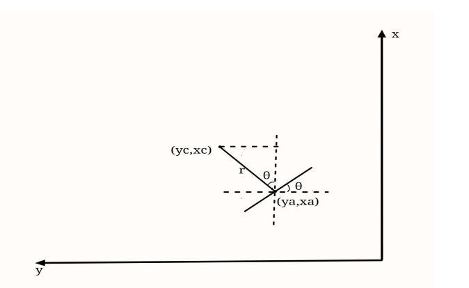

# 视觉

## 1. 装甲板识别算法

### 24赛季

24赛季使用识别算法基于是[沈航22年开源的装甲板识别模型](https://github.com/tup-robomaster/TUP-InfantryVision-2022)，该模型对印刷数字的识别准确率很高，但是对像前哨站、哨兵、基地图案识别的准确率很低，非常容易出现误识别，另外没有对紫色灯条的分类结果。

为加速推理速度，考虑到使用的工控机都是`Intel`的，所以加速引擎使用`OpenVINO`。

### 25赛季建议

基于陈君的rv(rm_vision)框架:

对灯条的识别使用传统视觉，对数字图案的分类使用神经网络。

1.图像预处理

- 转灰度图
- 二值化

2.对灯条的轮廓匹配的几何特征筛选逻辑有

- 轮廓的长宽比
- 旋转矩形倾斜角度

3.对装甲板的两两灯条匹配

首先剔除

- 忽略掉两灯条轮廓形成的矩形中包含其他灯条轮廓的
- 剔除两灯条轮廓颜色不一致的

几何特征

- 两灯条的长度比
- 两灯条轮廓的中心点距离 / 两灯条平均长度

为了保证后续PnP精度，剔除掉倾斜角度太大的，这通过比较两灯条中心形成的夹角

4.提取出中间数字

- 透视变换
- 取中间ROI
- 大律法二值化

5.数字分类

陈君的数字分类基于多层感知机，在测试后该模型

- 对印刷数字分类准度高
- 难以识别到前哨站等复杂图案

优化建议

- 基于该模型重新训练
- 训练时对图片加入椒盐噪声等

### 注意事项

- 神经网络
  - 对紫色灯条的识别不要出现误识别
  - 注意小、大装甲板的分类
  - 注意复杂图案的分类的准确度

## 2. 目标跟踪算法

几个坐标系

装甲板坐标系: 从装甲板正面看向装甲板，x 正前方，y 正左方，z 垂直向上。

相机坐标系: 从相机背面看向相机，x 为正右方，y 为正下方，z 为正前方。

云台坐标系(IMU): x 正前方，y 正左方，z 垂直向上。 

(IMU)惯性坐标系: x 正前方，y 正左方，z 垂直向上。

枪口坐标系: x 正前方，y 正左方，z 垂直向上。 

roll、pitch、yaw 分别为绕 x、y、z 轴的旋转，从对应的轴的正向看去，逆时针旋转为正。

整车观测基于一下几点

- 可得到装甲板的角度
- 装甲板之间的角度差值固定

$$
\begin{cases}
x_c = x_a + r*cos\theta \\
y_c = y_a + r*sin\theta \\
\end{cases}
$$
$(x_a, y_a)$为识别到的装甲板在惯性系下的坐标

$(x_c, y_c)$为识别到的车辆中心在惯性系下的坐标

$\theta$为装甲板坐标系相对于惯性系的旋转

r为车辆半径

扩展卡尔曼的观测向量Z: 
$$
\begin{bmatrix}
x_a \\
y_a \\
z_a \\
\end{bmatrix}
$$
预测的状态向量X:
$$
\begin{bmatrix}
x_c \\
v_{x_c} \\
y_c \\
v_{y_c} \\
z_c \\
v_{z_c} \\
\theta \\
v_{\theta} \\
r
\end{bmatrix}
$$
状态转移方程: 
$$
\begin{cases}
x_c' = x_c + v_{x_c} * dt \\
y_c' = x_c + v_{y_c} * dt \\
z_c' = x_c + v_{z_c} * dt \\
\end{cases}
$$
状态转移矩阵:
$$
\begin{bmatrix}
1 & dt & 0 & 0 & 0 & 0 & 0 & 0 & 0 \\
0 & 1 &  0 & 0 & 0 & 0 & 0 & 0 & 0 \\
0 & 0 &  1 & dt & 0 & 0 & 0 & 0 & 0 \\
0 & 0 & 0 & 1 & 0 & 0 & 0 & 0 & 0 \\
0 & 0 & 0 & 0 & 1 & dt & 0 & 0 & 0 \\
0 & 0 & 0 & 0 & 0 & 1 & 0 & 0 & 0 \\
0 & 0 & 0 & 0 & 0 & 0 & 1 & dt & 0 \\
0 & 0 & 0 & 0 & 0 & 0 & 0 & 1 & 0 \\
0 & 0 & 0 & 0 & 0 & 0 & 0 & 0 & 1 \\
\end{bmatrix}
$$
观测方程:
$$
\begin{cases}
x_c = x_a + r*cos\theta \\
y_c = y_a + r*sin\theta \\
z_c = z_a \\
\theta = \theta \\
\end{cases}
$$
通过卡尔曼滤波获取最优状态之后算出四个装甲板的位置

$$
\begin{cases}
x_{ia} = x_c - r * cos(\theta + i * 2\pi/armor\_num) \\
y_{ia} = y_c - r * sin(\theta + i * 2\pi/armor\_num) \\
z_{ia} = z_c + dz \\
\end{cases}
$$
dz是两块高低装甲板的高度差值

 要注意的是卡尔曼滤波器的输出时当前状态的最优状态，预测需要根据最优状态+预测时间来计算

## 3. 误差分析

目标转速以前哨站转速为例 $\omega = 0.8\pi rad/s = 0.8 * 180° /s = 144°/s = 0.144°/ms$ (每差出10ms的延迟就会差出1.44°的误差)

子弹速度按$v = 27m/s$计算

预测的延迟时间由下列几部分组成

| 项目                                         | 延迟                               |
| -------------------------------------------- | ---------------------------------- |
| 相机曝光                                     | 根据设置的曝光时间                 |
| 视觉程序处理时间                             | 根据算法不同有5ms~20ms(或更高)不等 |
| 通信延迟                                     | 小                                 |
| 控制端响应(云台响应、拨弹盘响应、摩擦轮加速) | 小                                 |
| 子弹飞行时间(主要)                           | 距离 / 子弹速度                    |

# 电控

IMU的放置方向: 坐标指示为x正前方，y朝左，z正上方

对遥控器按键设置建议

- 右-下: 急停
- 右-中: 手动瞄准(主要为了测试散度)
    - 左-下: 摩擦轮停止;
    - 左-中: 摩擦轮开启;
    - 左-上: 发弹(单次从中->上发一次，长时间停留在上方连发)
- 右-上: 自瞄
    - 左-下: 摩擦轮停止;
    - 左-中: 自瞄跟随, 摩擦轮开启;
    - 左-上: 自瞄发弹(单次从中->上发一次，长时间停留在上方连发)

另外调自瞄的车不要底盘跟随，被打击车辆底盘跟随

陀螺仪矫正地磁

# 机械

相机、IMU、枪口使用刚性连接，保证相对位置不会变化。每次这三者位置只要有一个变化自瞄系统都需要重新调整参数。

拨弹盘别卡弹

散度要保证

# 操作手

要多给操作手使用自瞄，每次调试完自瞄后不要仅仅视觉这边觉得好的，要让操作手觉得自瞄好了。在调试完成之后让操作手连接图传和服务器和步兵对打，主要要让知道自瞄的稳定性如何，能不能使用，击杀一台步兵需要的时间和自瞄具体效果。

# 其他

每场比赛都要录制官方比赛界面和操作手第一视角来分析自身不足

下次检录时建议带上可佩戴的录制设备录制检录过程

比赛时选择居住的房子的时候建议选择能有一个较宽敞的地能够简单测试车的各个功能（比如自瞄），记得带上能够固定车的绳子什么的

工程中心的场地建议改一下，建议有

- 测试散度(保证弹丸不会飞出)
- 自瞄调试(保证有至少有5m的距离，保证弹丸不会飞出，保证车辆有宽敞的平移距离用来测试自瞄，保证有高打底、低打高的场地)
- 英雄5m~6m吊射前哨站
- 英雄9m~10m吊射前哨站
- 上坡功率测试
- .....

# 24赛季时间轴

## 官方测试(以8月1日为起点)

- [规则测评]([https://www.robomaster.com/zh-CN/resource/pages/announcement/1693) 2024年1月12日18:00-1月13日18:00 (165天)
- [中期考核](https://www.robomaster.com/zh-CN/resource/pages/announcement/1691) 2024年2月26日18:00—2024年2月28日18:00   (46天)(211天=30星期=7个月)
- [中期考核结果](https://www.robomaster.com/zh-CN/resource/pages/announcement/1705) 2024-03-12 (13天)
- [完整形态考核](https://www.robomaster.com/zh-CN/resource/pages/announcement/1706)2024年4月1日18:00-2024年4月3日18:00 (35天)(距中期考核提交时间)
- [完整形态考核结果](https://www.robomaster.com/zh-CN/resource/pages/announcement/1707) 2024-04-13 (10天)
- [中部赛区](https://terra-1-g.djicdn.com/b2a076471c6c4b72b574a977334d3e05/RM2024/RoboMaster%202024%20%E6%9C%BA%E7%94%B2%E5%A4%A7%E5%B8%88%E8%B6%85%E7%BA%A7%E5%AF%B9%E6%8A%97%E8%B5%9B%E5%8F%82%E8%B5%9B%E6%89%8B%E5%86%8C%EF%BC%88%E4%B8%AD%E9%83%A8%E8%B5%9B%E5%8C%BA%EF%BC%89V2.0%EF%BC%8820240430%EF%BC%89.pdf) 2024 年 5 月 19 日 (46天) (292天=41星期=9个月)

## 队伍

### 视觉

- 2023-10-20 装甲板识别 + PnP解算

- 2023-11-02 追踪器设计

- 2023-11-20 弹道补偿 + 发现相机坐标系下的预测会有问题

- 2023-12-13 坐标转换

- 2024-01-22 不断试错、调试卡尔曼参数、跟踪器逻辑、多线程逻辑、配置文件、可视化

- 2024-01-25 尝试整车观测模型+将对车辆运动状态预测转移到下位机

- 2024-04-04 尝试理解整车观测+调试完整形态考核+逐渐将项目转移到ros2下+不断踩坑

- 2024-04-13 项目整体转移到ros2下，整车观测调试基本理解、成功 + 设置开机自启 + 尝试融入docker

- 2024-04-27 不断完善程序和启动脚本和与docker的融合以及与电控不断调试、试错

- 2024-04-29 调试了一个星期不到的英雄，发现识别精度在5~6m达不到英雄自瞄的程度

- 2024-05-10 更细致考虑哨兵双头自瞄逻辑，将双头逻辑与其余兵种自瞄逻辑融洽的整合到一起，调试了2~3天哨兵

- 2024-05-15 修改程序使能够更好的适配两个云台的哨兵

- 2024-05-20 由于哨兵每次都要软件重启导致串口中断，使基于docker的程序无法使用串口，添加了串口多次连接失败后重启功能

- 2024-05-23 0:2 太原工业学院24赛季结束

  

- 老步兵是调试时间最长的几乎整个自瞄从无到有都是老步兵的功劳，可以说如果没有上年留下的这台车就没有现在的自瞄

- 新步兵开始调试自瞄大概是在5月初，因为新老步兵都是一个云台，自瞄系统的调试在这时候已经相对比较成熟了，所以在之后机械拆车改进、电控布线、调试、操作手训练的间隙下还是调的差不多了（虽然还是出现了一些问题）

- 哨兵开始调试自瞄是在准备中期考核的时候，但那时候只调试了一个云台，主要是因为

  - 机械: 有个头好像还有点问题(也可能是我记错了)，散度不低(好像是因为下面的什么东西太薄，导致发弹时会抖动)，拨弹盘有时会卡弹
  - 电控: 调试双云台还有些问题
  - 视觉: 自瞄系统还不成熟、不稳定
  - 要给出一份哨兵的中期考核的答卷
  - 总之就是难以同时调试好两个云台

  之后的调试是在完整形态考核的时候，也是只调试了一个云台，原因还是差不多还是上面的

  完整形态考核之后，断断续续调试了半个月还是一个星期不到的哨兵，这个时候基本才开始同时调试两个云台，但每次调试都会有问题，比如卡弹、散度不低、调试两个云台导致枪管断了等。有时候问题比较好解决，但有时要重新拆装云台这就导致电控需要重新布线、调云台，自瞄系统也需要重新调，还有在5.19还是5.20才发现相机、IMU、枪管之间的固定不是刚性连接（相机、IMU和枪管之间的连接是有松动的），这就导致自瞄系统不稳定，因为这三者的位置一旦发生改变（哪怕是很微小的改变）都会导致打不到。

  总结一下今年哨兵没有发挥的原因就是

  - 双云台不好调试
  - 留出的调试时间也短
  - 总是出各种问题
  - 哨兵需要同时调试自瞄和导航
  - 经验不足
  - .....

# 各兵种24赛季问题

一下仅以我作为一个视觉成员的**主观**看法（作为一个视觉也不懂机械和电控，所以只能说出一些肤浅的）

## 英雄

弹丸对英雄设计影响很大，建议下赛季购买/租借官方弹丸

弹速波动

弹速波动和在5m~6m处自瞄识别精度不够，导致英雄自瞄很难实现

## 老步兵

老步兵基本陪伴了整个自瞄系统的开发，没有老步兵就没有这一赛季的自瞄。老步兵的设计基本很稳定，但由于弹仓是在头上，导致弹仓内不同的弹丸数会导致俯仰角不同，除此外基本没有很大问题。

## 新步兵

新步兵出车不快，基本是在集训时整体机械结构才正式稳定下来。

自瞄在临出发时还会出现断线问题，还有在打南昌大学的时候调参后忘记修改。

## 哨兵

哨兵出车慢，并且在之后的过程中还是会断断续续出现一些问题，诸如卡弹、散度、结构保护、结构固定等。

电控对两个云台的调试、协同也不是很成熟。

自瞄最终也没有解决哨兵两个云台为什么会比其他兵种（的单个云台）的响应慢很多，基本都是分段响应，还有命中率低。

导航最终也没能做出很好的效果，前两次比赛都没用到，最后比赛好在是终于修复了自启动BUG，可以再巡逻区内导航，但可能是因为精度不够高，导航到了巡逻区外，使基地护甲展开。

## 自瞄

没有对各个兵种的偏移量参数进行更精细的调参

没有很好的测试出预测延迟

击打小陀螺时会出现弹道偏低的情况，初步猜测是因为平移给的预测时间过大，解决方法

- 降低平移的预测时间（重新精调平移预测时间）

- 将z轴预测时间给成0)，同时对小陀螺的命中率还不是很高

对前哨站、哨兵的图案分类效果差

在5m后精度降低

# 其他

因为之前的学长几乎没有留下什么东西（基本没有什么传承，就只有一个虚拟串口通信非常有用，不过之后换成ros2框架之后把虚拟串口通信也改了），所以说今年的整个自瞄系统说是从无到有也不是很夸张，在开发的过程中几乎把所有能踩过的坑都踩过了一遍，有n多次百思不得其解，有太多的艰辛，太多的压力，尤其是在前段时间，指导老师不定时来压力、来否定、来批判、来说"你这的不行，你得这样那样"，熬了不少夜，流过几次泪。做了两年的视觉自瞄，其实最终自瞄的表现并不算是特别优秀，虽然打静止装甲板的命中率在5m内几乎是100%，但对小陀螺目标命中率还不是特别高，最终(通过操作手第一视角来看)在赛场上被用到的次数也只有屈指可数的几次，哨兵的自瞄因为各种原因也没有调好。作为自瞄的制作者本身，我是觉得自瞄对操作手的帮助是很大的，因为图传本身有延迟，人本身也很难非常快速将枪管对准到目标装甲板上，在目标较快速移动时也很难及时移动云台跟上目标，对枪口热量的把握、火控的精准等也有一定难度。不过确实有时自瞄也不太靠谱，但使用自瞄来达到辅助瞄准的目的也未尝不可。不过这也可能是因为我对操作手的能力认识过低。

感谢这2年来在实验室的经历、在RM比赛的这些经历，到现在我还记得大一熬夜做提前考核的场景，大一冬天实验室的冷，第一次看到之前队内的“屎山”`shibie`代码，第一次用传统视觉识别装甲板，第一次自己设计能量机关的识别，第一次调试卡尔曼滤波参数，看着那个预测点每次我都是懵的。还记得23赛季同样是2局0:2的不甘，暑假集训时的炎热以及工训赛时出现的各种问题。还有第一次用模型识别装甲板的、第一次将偏移的`yaw`、`pitch`发给下位机能够稳定跟踪装甲板，第一次发弹打到装甲板清脆的声音，第一次百思不得其解的漂移预测点，第一次真正对卡尔曼滤波器有了自己的认识，第一次击打到移动装甲板，第一次看到rv开源，第一次听懂chenjun的讲解，第一次理解坐标系转换，第一次理解整车观测，第一次一个人调四辆车，第一次没日没夜的调车，第一次吃饭喝水般的熬夜。以及最后两局0:2的24赛季。

虽然结局是这么的遗憾，但它让我学到了不少的知识，让我有了一段十分难得的也非常难忘的经历，让我能够认识这么多朋友，让我体会到辛酸、体会到成功、体会到失败、体会到孤独、体会到不被理解、体会到包容，让我能够看到不一样的大学、不一样的世界、不一样的人生与不一样的生活。
